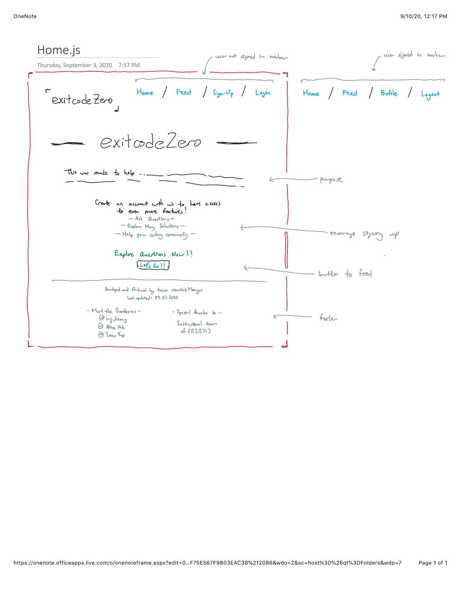
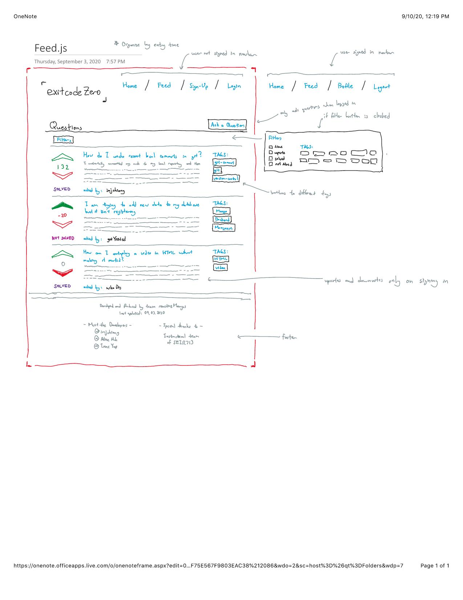
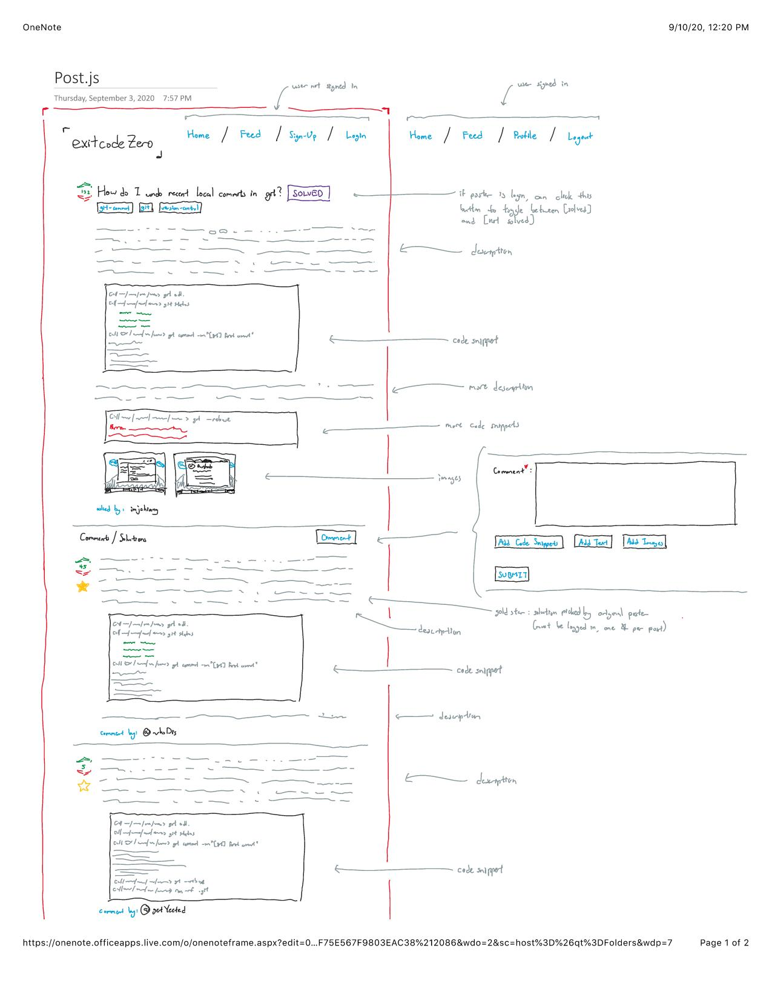
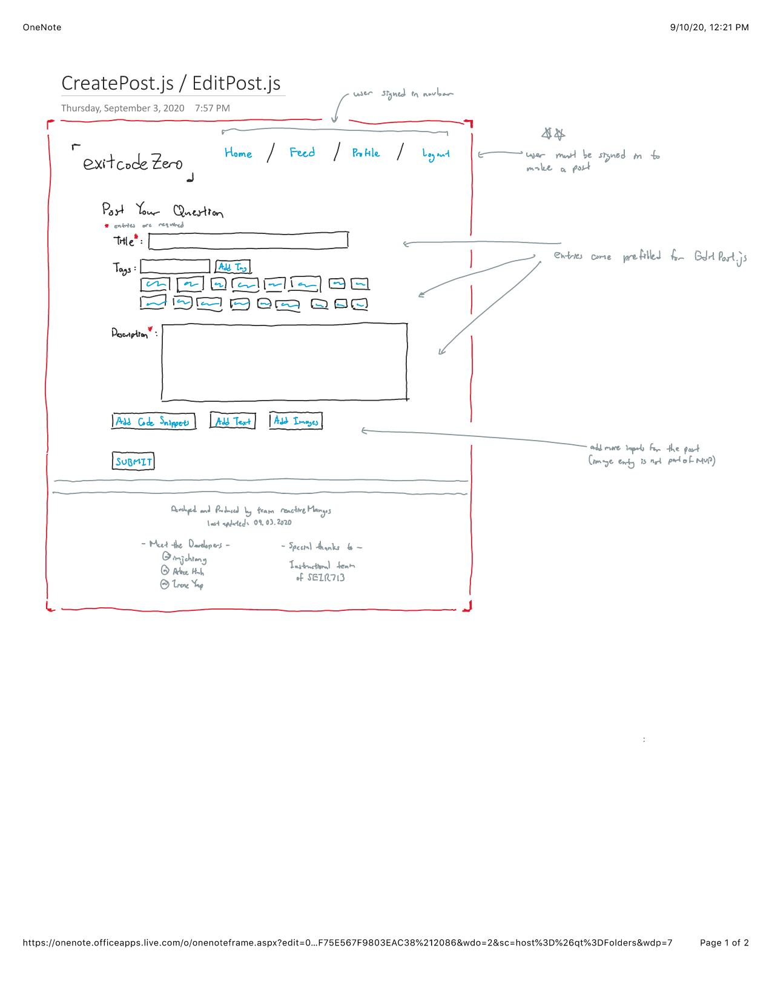
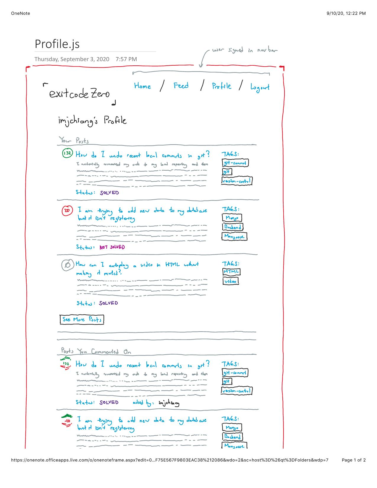

# exitcodeZERO -frontend
## Introduction

This is an app to explore the theory behind coding, to ask questions on coding, debugging, and to help others in the community of coders that collectively ask, learn, and help.

## Technologies Used
- MERN (MongoDB, ExpressJS, ReactJS, NodeJS) & CSS
- passport, passport-local
- dotenv: REACT_APP_SERVER_URL="http://localhost:8000" (connect to server)
- axios: communicate with server
- cloudinary: images stuff

## User Stories
### Users are able to login and post issues they are having with their code
- Title: purpose of the code / error or issue they are having
- Solved Tag: Indicates next to title whether the issue has been solved or not
  - Clicking on this tag links to the solution the author of the question used
- Tags: tags help label and categorize the issue
- Description: describe the issue, things attempted, tried solutions, where you think potential issues are, constraints
- Image (optional): can post image of debugging screen, code, desired product, etc...

## Wireframes








### `Installation Instructions`
1. Fork and clone the repository.
2. Install all the node packages (npm i).
3. add a .env file with REACT_APP_SERVER_URL="http://localhost:8000" which connected to server.
4. Run the app with npm start.
4. Open [http://localhost:3000](http://localhost:3000) to view it in the browser.
5. The page will reload if you make edits.


## Rundown Progress
- 05.09.2020 Set up gitrepo master and branches by Josh
  - complete main auth by Josh
  - component's frame create (Home, AllPost, Post, Profile) by Josh and Irene

- 06.09.2020 AllPosts, Post, NewPost implemented by team
  - add comment form, tag checkboxes and posts rendering to browser by Irene
  - axios successfully calls to specific post, user and tag by Josh

- 07.09.2020 Embedded comments stuff implemented by team
  - tags features solved at NewPost.js and add map method to call out all comments to post page by Irene
  - fix comments api call which typo issue by Alice
  - touch up syntax error, refresh/reload page, implement author name rendering by Josh

- 08.09.2020 Edit/Delete function implemented by team
  - auth permission to edit/delete specific post/comment by Josh
  - pass the put route api to EditPost.js and created new component for editing comment by Irene
  - check users verification by Josh
  - fix comments(embedded) bugs by Josh
  - add filter tags function and rendering out on AllPosts.js by Irene

- 09.09.2020 SolvedToggle and PickedSolution implemented by team
  - add SolvedToggle component by Irene
  - implement and solve SolveToggle issue by Josh
  - add Solution component by Josh
  - implement and solve Solution button by Josh
  - add image function by using cloundinary by Alice

- 10.09.2020 Cloudinary and Image stuffs solved by team
  - touch up and fix bugs (images matter) by Josh
  - Readme.md update by Irene
  - CSS styling by Josh

- 11.09.2020 Finalized and Presentation!

## Four Major hurdles we had to overcome

- Tags in NewPost.js: 
  Able to map all tags but hardness parts are limited tags checked and undo the previous checked box in NewPost.js. Finally got a solution as below: 

```javascript
if(e.target.checked) 
     {
        if (tags.length >= 5) {
            alert("Max 5 tags!")
            e.preventDefault()
            return
        }
            let newTags = []
            newTags = newTags.concat(tags,[e.target.value] )
            console.log(newTags)
            setTags(newTags) 
} 
    else 
    {
        let newTags = []
        newTags = tags.filter((t)=>{
        return t !== e.target.value
    })
       setTags(newTags)
    }
}}
<label className="form-check-label" htmlFor={"tag-" + eachTag.name}>{eachTag.name}</label>                   
```

- For filtering tags part in AllPosts.js: 
  we added a solution in backend-server and a function in component AllPosts.js for rendering. So we finally get all those checkboxes which tick by user for specific tag's posts they want.
```javascript
 <button onClick={()=>{
                let filter = tags.join(',')
                let url = `${process.env.REACT_APP_SERVER_URL}/api/posts/?filter=${filter}`
                console.log(url)
                axios.get(`${process.env.REACT_APP_SERVER_URL}/api/posts/?filter=${filter}`)
                .then(response => 
                {
                    console.log(response.data);
                    setPosts(response.data);
                });
            }} type="submit" className="btn btn-primary">Submit</button>
```

- SolvedToggle and SolutionPicked by post author:
  we took times to figure out a solved toggle checked (post) and starredOnPost (comment) which ticking by the post's author. We solved boolean matter in the SolveToggle.js and solved an api call by adding specific post's id & comment's id since comments is embeded in Schema.
  - SolveToggle.js
```javascript
if (solved)
        {
            axios.put(`${process.env.REACT_APP_SERVER_URL}/api/posts/${props.post._id}`, {solved: false})
            .then(()=> {
                window.location.reload(false);
            })
            .catch(error => console.log(error))
        }
        else
        {
            axios.put(`${process.env.REACT_APP_SERVER_URL}/api/posts/${props.post._id}`, {solved: true})
            .then(()=> {
                window.location.reload(false);
            })
            .catch(error => console.log(error));
        }
```
  - Solution.js
```javascript
if (props.user && post.author && props.user.id === post.author._id)
    {
        if (pickedSolution)
        {
            if (props.comment.starredOnPost)
            {
                return (
                    <button 
                        onClick={() => 
                        {
                            axios.put(`${process.env.REACT_APP_SERVER_URL}/api/posts/${post._id}/comments/editStatus`, {starredOnPost: false, comment: props.comment._id})
                            .then(()=> 
                            {
                                console.log(props.comment.starredOnPost);
                                window.location.reload(false);
                            })
                            .catch(error => console.log(error))
                        }}>
                        Remove Solution
                    </button>
                )
            }
            //if yes, can only mark "starredOnPost" as false
                //refresh page
        }
        else
        {
            return (
                <button 
                    onClick={() =>
                    {
                        axios.put(`${process.env.REACT_APP_SERVER_URL}/api/posts/${post._id}/comments/editStatus`, {starredOnPost: true, comment: props.comment._id})
                        .then(()=> 
                        {
                            window.location.reload(false);
                        })
                        .catch(error => console.log(error))
                    }}>
                    Set as Solution
                </button>
            )
            
        }
    }
```
- Upload images by using Cloudinary: we had an issue of asynchrone between browser and server when user uploading an image. Finally Gitmaster Mr. JOSHUA came out the below solution and it's working nicely! 
```javascript
let uploadImage = async e => 
    {
        setLoading(true);
        const files = e.target.files
        const data = new FormData()
        data.append('file', files[0])
        data.append('upload_preset', 'scft486b')
        if (data)
        {
            const res = await fetch(
                `https://api.cloudinary.com/v1_1/dc8ufznd0/image/upload`,
                {
                    method: 'POST',
                    body: data
                }
            )
            const file = await res.json() 
            setImgUrl(file.secure_url)
            setLoading(false)
            console.log(file.secure_url)
        }
        else
        {
            setLoading(false);
        }
    }
```
```javascript
 <button type="submit" className="btn btn-primary">{loading ? "Loading Image" : "Submit"}</button>
```

## CRUD - frontend

- AllPost.js : get the data from axios
```javascript
 useEffect(() =>
    {
        axios.get(`${process.env.REACT_APP_SERVER_URL}/api/tags`)
        .then(response =>
        {
            console.log(response.data);
            setAllTags(response.data);
        });
    }, []);
```

- NewPost.js : create a new post 
```javascript
axios.post(`${process.env.REACT_APP_SERVER_URL}/api/posts/`, newPost)
            .then(()=> {
                setTitle("")
                setTags()
                setDescriptionAndCode("")
                setImgUrl("")
                setLoading(true);
                // setAuthor(props.user.id);
            history.push("/allPosts")
            })
```

- EditPost.js : edit and update a post
```javascript
axios.put(`${process.env.REACT_APP_SERVER_URL}/api/posts/${referencedPost._id}`, newPost)
            .then(()=> {
                setTitle("")
                setTags([])
                setDescriptionAndCode("")
                setImgUrl("")
                setLoading(true);
                // loading = true;
                // reset back
            history.goBack()
            })
```

- Post.js : delete a post
```javascript
axios.delete(`${process.env.REACT_APP_SERVER_URL}/api/posts/${referencedPost._id}`)
        .then(response =>
        {
            console.log(response.data);
            history.push('/allPosts')
        });
```

